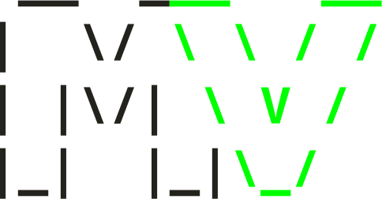

    

  <h4>
    <a href="https://github.com/Zybyte85/MicroVim/#Installation">Installation</a>
    ·
    <a href="https://github.com/Zybyte85/MicroVim/#Configuration">Configure</a>
     
    Simple, minimal, and extendable Neovim config
  </h4>

### Features
- 🧠 Full LSP support
- 🔧 Easily add plugins and configure
- 📦 Pre-configured plugins
- 📝 Simple code
- ⚡ Lightning fast
- 💤 Powered by [lazy.nvim](https://github.com/folke/lazy.nvim)

## Installation

### Prerequisites
1. Install the [requirements](https://github.com/Zybyte85/MicroVim#requirements)
2. Backup your existing Neovim config (if you have one)

### Requirements
- Neovim
- Git
- A [Nerd font](https://www.nerdfonts.com/) such as Hack Nerd Font (optional)

### Linux/MacOS
1. Download the [latest release](https://github.com/Zybyte85/MicroVim/releases/latest)
2. Extract it to ~/.config/nvim

### Windows
1. Download the [latest release](https://github.com/Zybyte85/MicroVim/releases/latest)
2. Open `Run` and put Appdata
3. Extract it to Local\nvim

## Configuration
### Adding plugins
You can add plugins the same way you would normally. Go to ~/.config/nvim/mvim/plugins and make the changes you want in the files there. If you are planning on doing this, I would suggest you fork this repository so you can keep your custom config as your own repository.
